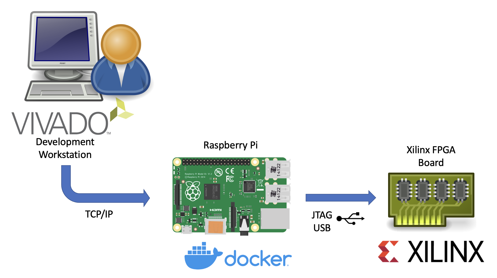

# Xilinx hw_server & xsdb Docker Image

This Docker image allows you to run Xilinx's `hw_server` as well as the Xilinx debugger `xsdb` in a Docker container.
Using QEmu user-space emulation, these tools can also run on embedded devices like a Raspberry Pi or the Ultra-scale boards themself.

- [Blog article with details](https://noteblok.net/2022/02/23/running-a-xilinx-hw_server-as-docker-container/)



## Tested Vivado versions

- [v2021.2](https://github.com/users/sstaehli/packages/container/hw_server/20585701?tag=2021.2)
- [v2020.1](https://github.com/users/sstaehli/packages/container/hw_server/20585725?tag=2020.1)

## Tested systems

- Raspberry Pi 4 with 64-bit Raspberry Pi OS (Debian Bullseye)

## Usage

### Docker

```bash
docker run --rm --restart unless-stopped --privileged --volume /dev/bus/usb:/dev/bus/usb --publish 3121:3121 --detach ghcr.io/sst/hw_server:2021.2
```

### Docker-Compose

Copy the docker-compose.yml file from this repo to your target's working directory (Raspberry Pi -> `/home/user/`) and run

```bash
docker-compose up -d
```

to start the container

## Running on non x86_64 systems

```bash
# Install docker
sudo apt-get update && sudo apt-get upgrade
curl -sSL https://get.docker.com | sh

sudo systemctl enable --now docker

# Optional: Install docker-compose (with Python3)
sudo apt-get install libffi-dev libssl-dev
sudo apt install python3-dev
sudo apt-get install -y python3 python3-pip
‍sudo pip3 install docker-compose

# Enable qemu-user emulation support for running amd64 Docker images
docker run --rm --privileged aptman/qus -s -- -p x86_64

# Run the hw_server with docker
docker run --rm --restart unless-stopped --privileged --volume /dev/bus/usb:/dev/bus/usb --publish 3121:3121 --detach ghcr.io/sst/hw_server:2021.2

# - OR -

# Run the hw_server with docker-compose (copy the docker-compose.yml to your working dir first)
docker-compose up -d
```

### Optional: An example how to permanently enable x86_64 Docker support

- Create a Shellscript containing aptman/qus command, e. g. `echo "docker run --rm --privileged aptman/qus -s -- -p x86_64" > /usr/local/bin/docker_x86_x64.sh`
- Register the shell script with `crontab -e` ... and add the line `@reboot sh /usr/local/bin/docker_x86_x64.sh`
   
The above steps in conjunction with the docker restart policy will make your hw_server start whenever your RaspberryPi is powered on.

## Building your own image

1. Download the _Vivado Lab Solutions_ Linux installer to the current directory.
   - **Do not extract it!**
   - E.g. `Xilinx_Vivado_Lab_Lin_2021.2_1021_0703.tar.gz`
2. Build the image with the [buildimage.sh](buildimage.sh) script

```bash
./buildimage.sh
```

### Note concerning Accept EULA

Depending on the Vivado version, you have to agree WebTalk (e. g. Version 2020.1) in the [Dockerfile](Dockerfile) or omit it (e. g. Version 2021.2). If this particular line does not match, Vivado installation will fail!

#### For 2021.2 and future versions

```bash
...
--agree XilinxEULA,3rdPartyEULA \
...
```

#### For 2020.1 and probably older versions

```bash
...
--agree XilinxEULA,3rdPartyEULA,WebTalkTerms \
...
```
